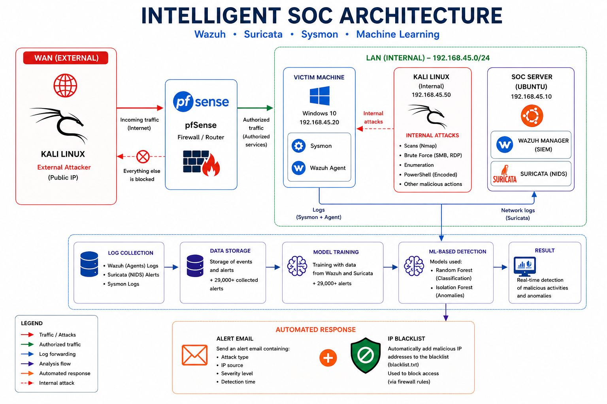
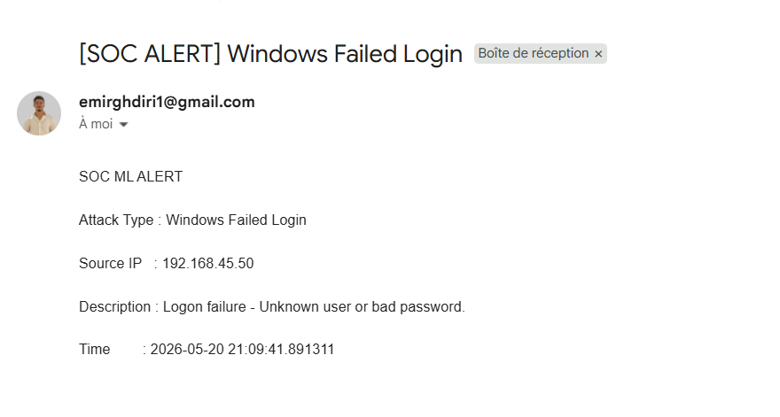
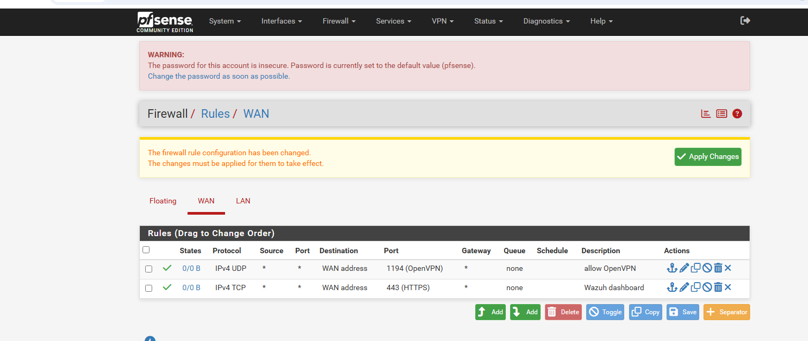

# 🛡️ Intelligent SOC System — Automated Cyberattack Detection

> Final Year Project | TEK-UP University | Cybersecurity Engineering  
> **Author:** Amir Ghediri  
> **Academic Supervisors:** Ms. Khouala Ammar & Mr. Hamdi Chebbi

---

## 📌 Project Overview

This project presents the design and implementation of an **Intelligent Security Operations Center (SOC)** built exclusively on open-source technologies and Machine Learning.

The goal is to demonstrate that a complete and effective monitoring infrastructure can be built to:
- Detect known attacks in real time
- Identify abnormal behaviors using AI
- Respond autonomously to detected incidents

---
## 🏗️ Architecture

The lab environment is built on **VMware Workstation** and consists of four virtual machines operating in an isolated network, separated by a pfSense firewall into two zones: a **WAN zone** simulating the external Internet, and a secured **LAN zone** (192.168.45.0/24) hosting the victim machine, the internal attacker, and the SOC server running Wazuh, Suricata, and the ML engine.

The diagram below illustrates the complete architecture of the Intelligent SOC system, including the network topology, data flow, ML pipeline, and automated response mechanism:




### Network Zones
- **WAN Zone** — Simulates the external Internet (external attacker)
- **LAN Zone** — Internal secured SOC network

### Virtual Machines
| VM | Role | Key Components |
|---|---|---|
| Kali Linux (WAN) | External attacker | Nmap, Hydra, enum4linux |
| Kali Linux (LAN) | Internal attacker | Nmap, Hydra, enum4linux |
| Windows 10 | Victim machine | Sysmon, Wazuh Agent |
| Ubuntu Server | SOC server | Wazuh Manager, Suricata, ML Engine |
| pfSense | Firewall / Router | WAN/LAN filtering, OpenVPN, HTTPS |

---

## 🛠️ Tools & Technologies

| Tool | Role |
|---|---|
| **Wazuh** | SIEM / EDR — log collection, correlation, analysis |
| **Suricata** | NIDS — real-time network intrusion detection |
| **Sysmon** | Windows event enrichment (processes, network, registry) |
| **pfSense** | Firewall and router — WAN/LAN traffic filtering |
| **Random Forest** | ML classification — known attack detection |
| **Isolation Forest** | ML anomaly detection — unknown threats |
| **Python** | Data collection, model training, automated response |
| **VMware Workstation** | Lab virtualization |
| **Kali Linux** | Attack simulation |

---

## 🔄 ML Pipeline

```
Wazuh Alerts  ──►  Data Collection  ──►  Dataset (alerts.csv)
                   (collect_data.py)       29,000+ alerts

Dataset  ──►  Model Training  ──►  Trained Models
              (train_model.py)      rf_model.pkl
                                    iso_model.pkl

Trained Models  ──►  Real-Time Detection  ──►  Automated Response
                      (detect_response.py)       Email alert
                                                 IP Blacklist
```

### Dataset
- **Total alerts collected:** 28,186
- **Normal events:** 9,576
- **Attack events:** 18,610
- **Features used:** `rule_id`, `rule_level`, `firedtimes`, `event_id`, `agent_encoded`

### Model Results
| Model | Precision | Recall | F1-Score |
|---|---|---|---|
| Random Forest | 1.00 | 1.00 | 1.00 |
| Isolation Forest | Unsupervised anomaly detection | — | — |

---

## ⚔️ Simulated Attacks

### Phase 1 — External Attacks (WAN)
- Nmap scan against the internal network from the WAN
- pfSense firewall tested before and after applying filtering rules
- **Result:** All unauthorized traffic blocked. Only OpenVPN (UDP 1194) and HTTPS (TCP 443) allowed


### Phase 2 — Internal Attacks (LAN)
| Attack | Tool | MITRE ATT&CK |
|---|---|---|
| Network scan | Nmap | T1046 |
| Vulnerability scan | Nmap `--script=vuln` | T1046 |
| SMB enumeration | enum4linux | T1135 |
| SMB brute force | Hydra | T1110 |
| RDP brute force | Hydra | T1110 |
| Encoded PowerShell | PowerShell | T1059.001 |
| User account creation | net user | T1136 |
| Persistence actions | Windows admin commands | T1098 |


---

## 🤖 Automated Response System

When a malicious activity is detected, `detect_response.py` automatically:

1. **Classifies** the alert using the trained ML models
2. **Sends an email alert** to the SOC administrator containing:
   - Attack type
   - Source IP address
   - Severity level
   - Detection timestamp
3. **Adds the malicious IP** to a local blacklist (`blacklist.txt`)
4. **Logs** the incident for audit trail



---

## 📁 Repository Structure

```
intelligent-soc-lab/
│
├── screenshots/               # Project screenshots
├── collect_data.py            # Collect alerts from Wazuh API
├── train_model.py             # Train Random Forest + Isolation Forest
├── detect_response.py         # Real-time detection + automated response
├── alerts_sample.csv          # Sample dataset (50 alerts)
└── README.md
```

---

## 🚀 Getting Started

The following steps cover the most important stages of the project setup. Some configuration details and intermediate steps have been omitted for clarity — refer to the full project report for a complete walkthrough.

### Prerequisites
- VMware Workstation (or VirtualBox)
- Ubuntu Server 22.04 — SOC Server
- Windows 10 — Victim Machine
- Kali Linux — Attacker Machine
- pfSense 2.x — Firewall / Router
- Python 3.8+

---
### Step 1 — Network Setup (pfSense)

Deploy pfSense as the firewall/router between WAN and LAN zones:
- **WAN interface** → external network (Internet simulation)
- **LAN interface** → `192.168.45.0/24` (internal SOC network)

**WAN Rules** — block all unauthorized inbound traffic:
- Allow **OpenVPN** (UDP 1194) — for secure remote access
- Allow **HTTPS** (TCP 443) — for Wazuh dashboard access
- Block **everything else** by default

**LAN Rules** — allow internal communication between:
- Windows 10 victim machine (`192.168.45.20`)
- Kali Linux internal attacker (`192.168.45.50`)
- Ubuntu SOC server (`192.168.45.10`)
- All internal traffic is monitored by Suricata and Wazuh



---

### Step 2 — Deploy Wazuh Manager (Ubuntu Server — 192.168.45.10)

```bash
# Download and run the Wazuh installation script
curl -sO https://packages.wazuh.com/4.x/wazuh-install.sh
sudo bash ./wazuh-install.sh -a

# Verify Wazuh is running
sudo systemctl status wazuh-manager
```

Access the Wazuh dashboard at: `https://192.168.45.10`

---

### Step 3 — Deploy Suricata NIDS (Ubuntu Server)

```bash
# Install Suricata
sudo apt-get install suricata -y

# Update Suricata rules
sudo suricata-update

# Start Suricata on the LAN interface
sudo suricata -c /etc/suricata/suricata.yaml -i ens33

# Verify Suricata is running
sudo systemctl status suricata
```

Integrate Suricata alerts into Wazuh by adding the following to `/var/ossec/etc/ossec.conf`:
```xml
<localfile>
  <log_format>json</log_format>
  <location>/var/log/suricata/eve.json</location>
</localfile>
```

---

### Step 4 — Install Sysmon on Windows 10 (Victim — 192.168.45.20)

```powershell
# Download Sysmon and configuration file
Invoke-WebRequest -Uri "https://download.sysinternals.com/files/Sysmon.zip" -OutFile "Sysmon.zip"
Invoke-WebRequest -Uri "https://raw.githubusercontent.com/SwiftOnSecurity/sysmon-config/master/sysmonconfig-export.xml" -OutFile "C:\Sysmon\sysmonconfig.xml"

# Install Sysmon with the configuration
.\Sysmon64.exe -accepteula -i sysmonconfig.xml

# Verify Sysmon is running
Get-Service -Name Sysmon64
```

---

### Step 5 — Install Wazuh Agent (Windows 10)

Download the Wazuh Agent installer from the Wazuh dashboard, then:

```powershell
# Verify the agent is running
Get-Service WazuhSvc
```

Edit `C:\Program Files (x86)\ossec-agent\ossec.conf` to enable Sysmon log collection:
```xml
<localfile>
  <location>Microsoft-Windows-Sysmon/Operational</location>
  <log_format>eventchannel</log_format>
</localfile>
```

---

### Step 6 — Install Python Dependencies (Ubuntu Server)

```bash
pip3 install pandas scikit-learn requests
```

---

### Step 7 — Run the ML Pipeline

```bash
# Step 7.1 — Collect alerts from Wazuh API
sudo python3 collect_data.py
# Output: alerts.csv (28,000+ alerts)

# Step 7.2 — Train the ML models
sudo python3 train_model.py
# Output: rf_model.pkl, iso_model.pkl, label_encoder.pkl

# Step 7.3 — Start real-time detection and automated response
sudo python3 detect_response.py
# The system will now monitor alerts, send email notifications
# and automatically blacklist malicious IPs
```

---

### Step 8 — Attack Simulation

#### Phase 1 — External Attacks (WAN)

```bash
# Nmap scan from Kali Linux (WAN) — before pfSense rules
nmap -sS -A -T4 192.168.45.20

# After applying pfSense WAN rules → all traffic blocked except OpenVPN & HTTPS
```

#### Phase 2 — Internal Attacks (LAN)

```bash
# 8.1 — Network scan
nmap -sS -A -T4 192.168.45.20

# 8.2 — Vulnerability scan
nmap --script=vuln 192.168.45.20

# 8.3 — SMB Enumeration
enum4linux 192.168.45.20

# 8.4 — SMB Brute Force (MITRE ATT&CK T1110)
hydra -I -l administrator -p wrongpass smb://192.168.45.20 -t 1

# 8.5 — RDP Brute Force (MITRE ATT&CK T1110)
hydra -I -l administrator -p wrongpass rdp://192.168.45.20 -t 1

# 8.6 — Post-exploitation (on Windows 10 victim machine)
# Encoded PowerShell execution (MITRE ATT&CK T1059.001)
powershell -EncodedCommand dwBoAGBAYQBtAGkA

# Create a new user (MITRE ATT&CK T1136)
net user test1 Pass123! /add

# Delete the user
net user test1 /delete
```

> ⚠️ All attacks were performed in an **isolated lab environment** for educational purposes only.

---

## 📊 Detection Results

The system successfully detected all simulated attacks:

- ✅ **Nmap scans** — detected by Suricata, forwarded to Wazuh
- ✅ **SMB / RDP brute force** — detected by Wazuh Windows security rules
- ✅ **Post-exploitation (PowerShell, user creation)** — detected by Sysmon via Wazuh
- ✅ **Real-time ML classification** — Random Forest achieved 100% accuracy on the test set
- ✅ **Automated email alerts** sent upon attack detection
- ✅ **Malicious IPs automatically blacklisted**

---

## 🔮 Future Improvements

- Integration of a full **SOAR** platform
- Automatic IP blocking directly via **pfSense API**
- Use of **Deep Learning** models for improved detection
- Deployment in a **cloud environment** (AWS / Azure)
- Advanced **incident dashboard** for real-time monitoring

---

## 📚 References

- [Wazuh Documentation](https://documentation.wazuh.com)
- [Suricata Documentation](https://suricata.readthedocs.io)
- [MITRE ATT&CK Framework](https://attack.mitre.org)
- [Sysmon - Sysinternals](https://docs.microsoft.com/en-us/sysinternals/downloads/sysmon)
- [pfSense Documentation](https://docs.netgate.com/pfsense)
- Breiman, L. (2001). *Random Forests*. Machine Learning Journal.
- Liu, F.T., Ting, K.M., Zhou, Z.H. (2008). *Isolation Forest*. IEEE ICDM.

---

## 📄 License

This project was developed as part of a Final Year Engineering Project at TEK-UP University.  
For academic and educational use only.
